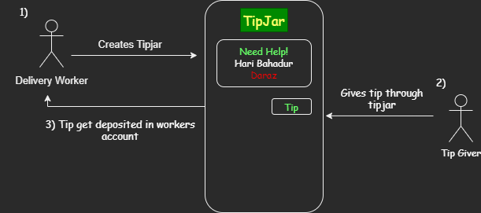

## Tip Jar - An Online Tipping System

## The Problem
Since everything is going online, delivery people are not getting the tips they used to get previously. Tips can be a major addition to a delivery person but as people pay for the things online, they donot even remember tipping their delivery person.

## The Solution
Tip Jar is an online tipping system whereby, delivery workers can create a tip jar and the people who order goods can tip them with ease even when they have no cash in hands.

## Demo Video

https://www.youtube.com/watch?v=DSziYluy5Xo

## Userflow

# Delivery Worker
1. Creates an account.
2. Creates a tip jar providing all information.
3. Waits for the admin to approve.
4. Connects his cardor paypal account.

# Tip Provider
1. Creates an account.
2. Searches for delivery person.
3. Tips him/her using card or paypal.
4. 

## Description

Delivery people work day and night to ensure that our needs are met on time. As a result, it is our job to recognize their distress and aid them in any way we can. Giving them a tip is a fantastic approach to make their experience more enjoyable while also assisting them financially. Though we may consider a single tip to be little, these single tips from everyone might add up to a substantial number for them. However, as everything has gone online, the tradition of tipping is progressively fading. People pay the price for the things they deliver online and, at times, there is no interaction between them and the delivery person. Though it seems to be good for people as they do not have cash in hand nowadays, it is saddening for those delivery workers. Thus we have made Tip Jar. Tip jar is an online tipping system where people can search for delivery workers either from service or their name and id and provide them with a tip. Delivery workers need to create a tip jar for collecting tips providing useful information and need to connect either a card or their PayPal account for withdrawal. The person providing a tip can choose to tip anonymously or provide his name. Tip Jar hereby, is trying to help our everyday heroes who are working 24/7 for us.
There is also a chatbot made using IBM Watson that answers people's query regarding the tipping system , tip jars and provides facts about delivery people.

## Project roadmap

The project currently has the following features:

1. Tip Jar Creation for Delivery workers

2. Tipping system for other users

3. Chatbot made using IBM Watson

## Getting Started

For running this project you just need to

1. Clone the repository
2. Create a database
3. Put in the database credentials in the .env file

## Live Demo
The project is hosted live at
http://etip.educationhost.cloud/

## Built with
 
 Laravel - Web framework
 
 Mysql - for database
 
 IBM Watson- for chatbot
 
 ## Authors

